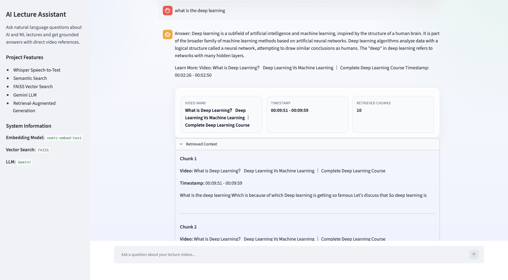
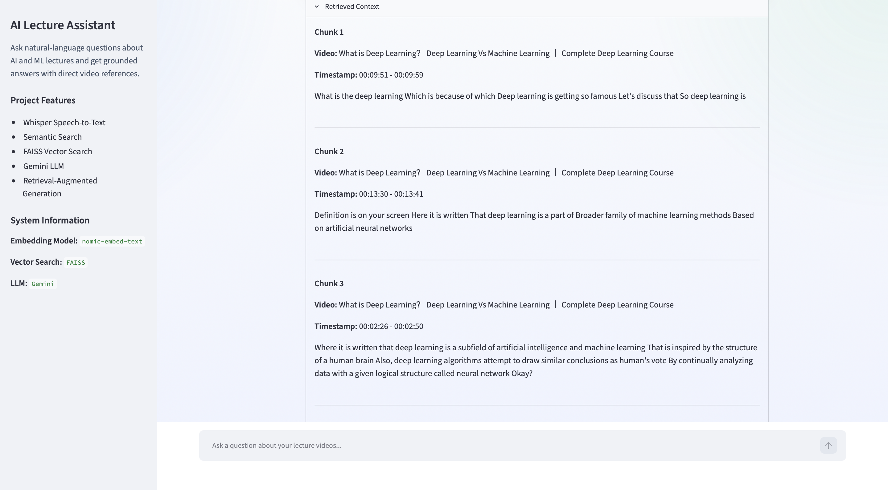
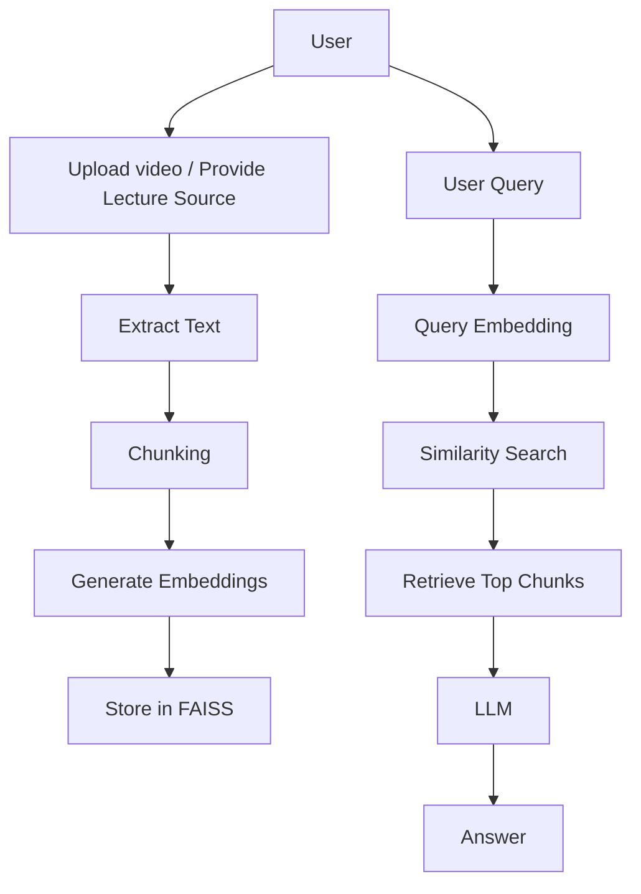

# DocMind AI: Chat with Your Documents Using Local LLMs

<table>
  <tr>
    <td align="center">
      <br>
      <b>Home Page</b>
    </td>
    <td align="center">
      <br>
      <b>Chat Interface</b>
    </td>
  </tr>
</table>


## Project Overview

`AI Lecture Assistant` solves a common problem in long-form educational content: finding the exact moment where a concept is explained without manually scrubbing through hours of video.

Instead of relying on keyword search alone, the project converts lecture transcripts into dense vector embeddings, stores them in a FAISS index, retrieves the most semantically relevant chunks for a user query, and then uses an LLM to produce a grounded answer with the most relevant video title and timestamp.

This project is suitable for:

- Students navigating long AI/ML lecture playlists
- Educators building searchable learning assistants
- Developers learning end-to-end RAG system design
- Recruiters and OSS reviewers evaluating practical applied AI engineering

### How RAG Works Here

In this repository, Retrieval-Augmented Generation is implemented as a staged pipeline:

1. Lecture videos are transcribed with Whisper.
2. Transcript segments are merged into larger semantic chunks.
3. Each chunk is embedded with `nomic-embed-text` using Ollama.
4. Embeddings are indexed in FAISS for fast nearest-neighbor retrieval.
5. A user question is embedded with the same embedding model.
6. Top matching chunks are retrieved from FAISS.
7. A prompt is assembled from retrieved context.
8. Gemini generates a grounded answer and recommends the best video/timestamp.

### Why Local Embeddings

Local embeddings are used to keep retrieval:

- Private, because transcript data does not need to leave the machine
- Cost-efficient, because repeated embedding calls do not incur API charges
- Fast for iteration, especially during indexing and repeated query testing
- Predictable, because the same embedding model is used for both chunking-time and query-time semantics

### Why FAISS

FAISS is used because it provides:

- High-performance vector search
- A simple local index file format
- Good compatibility with NumPy-based pipelines
- A strong baseline for production-minded semantic retrieval systems

### Why Ollama

Ollama is the local serving layer for embeddings in this project. It makes the embedding pipeline easy to run and reproduce on a developer machine while preserving the option to swap models later with minimal application changes.

---

## Features

<table>
  <tr>
    <td>✅ <strong>Speech-to-Text</strong><br/>Whisper-based lecture transcription.</td>
    <td>✅ <strong>Automatic Text Extraction</strong><br/>Transcript ingestion from processed videos.</td>
    <td>✅ <strong>Smart Chunking</strong><br/>Adjacent transcript segments are merged for better context.</td>
  </tr>
  <tr>
    <td>✅ <strong>Embedding Generation</strong><br/>Batch embedding creation for transcript chunks.</td>
    <td>✅ <strong>Local Embeddings (Nomic)</strong><br/>Uses <code>nomic-embed-text</code> through Ollama.</td>
    <td>✅ <strong>FAISS Vector Database</strong><br/>Local dense-vector similarity search.</td>
  </tr>
  <tr>
    <td>✅ <strong>Semantic Search</strong><br/>Question-to-chunk similarity retrieval.</td>
    <td>✅ <strong>RAG Pipeline</strong><br/>Retrieval-grounded prompt construction.</td>
    <td>✅ <strong>LLM Answer Generation</strong><br/>Gemini response generation from retrieved context.</td>
  </tr>
  <tr>
    <td>✅ <strong>Streamlit UI</strong><br/>Interactive web interface for querying lectures.</td>
    <td>✅ <strong>Timestamp Recommendations</strong><br/>Returns the most relevant lecture interval.</td>
    <td>🚧 <strong>PDF Upload</strong><br/>Planned as a future ingestion mode.</td>
  </tr>
</table>

---

## Architecture




---

## Workflow

### 1. Ingest Source Material

Lecture videos are processed through Whisper, which produces timestamped transcript segments. These segments are saved as JSON files and retain source metadata such as lecture title and start/end offsets.

### 2. Normalize and Chunk Content

The project merges consecutive transcript segments into larger units using `merge_chunks.py`. This improves retrieval quality by giving each chunk enough surrounding context to answer concept-level questions rather than matching isolated fragments.

### 3. Generate Embeddings

`text_to_vector.py` batches chunk text through Ollama's `nomic-embed-text` model and stores the resulting vectors alongside transcript metadata in `data/embeddings.pkl`.

### 4. Build the FAISS Index

`faiss_utils.py` converts the embedding column into a `float32` matrix and writes a local FAISS index. The current implementation uses `IndexFlatL2` with a vector dimension of `768`.

### 5. Accept a User Query

Users can ask questions through either:

1. `main.py` for CLI interaction
2. `app.py` for Streamlit interaction

### 6. Embed the Query

The query is embedded with the same `nomic-embed-text` model used during indexing. This keeps query vectors and document vectors in the same semantic space.

### 7. Retrieve Relevant Chunks

The embedded question is searched against FAISS and the top matching transcript chunks are returned. The Streamlit app currently uses `TOP_K = 10`.

### 8. Build a Grounded Prompt

`prompt.py` serializes the retrieved rows into prompt context and instructs the LLM to answer only from the retrieved lecture content or fall back to a watch recommendation when confidence is low.

### 9. Generate the Final Answer

`llm_response.py` sends the prompt to `gemini-2.5-flash`, which returns:

- A concise answer
- The most relevant lecture title
- The recommended timestamp range

> [!TIP]
> Retrieval quality depends heavily on chunk design. If answers feel fragmented, tune chunk grouping before changing the LLM.

> [!NOTE]
> The current repository uses Gemini for answer generation while keeping embeddings local via Ollama.

> [!WARNING]
> If `data/embeddings.pkl`, `data/vector_index.faiss`, or transcript JSON files are missing, the query pipeline will not return usable results.

---

## Project Structure

```text
RAG_Project/
├── app.py
├── main.py
├── embedding.py
├── faiss_utils.py
├── llm_response.py
├── prompt.py
├── text_to_vector.py
├── cosine_similar_vectors.py
├── merge_chunks.py
├── spech_to_text.py
├── docs/
│   ├── extra_info.png
│   └── home.png
├── data/                      # TODO: generated locally
│   ├── embeddings.pkl
│   └── vector_index.faiss
├── jsons/                     # TODO: generated locally
├── videos/                    # TODO: local source videos
├── requirements.txt           # TODO: commit or generate
└── README.md
```

---

## Installation

### 1. Clone the Repository

```bash
git clone https://github.com/KaranBayas/rag_project.git
cd rag_project
```

### 2. Create a Virtual Environment

```bash
python -m venv .venv
```

### 3. Activate the Environment

```bash
source .venv/bin/activate
```

Windows:

```powershell
.venv\Scripts\activate
```

### 4. Install Dependencies

```bash
pip install -r requirements.txt
```

If `requirements.txt` is not yet available in your clone, install the core packages manually:

```bash
pip install streamlit pandas numpy faiss-cpu ollama openai-whisper python-dotenv google-genai
```

### 5. Start Ollama

```bash
ollama serve
```

### 6. Pull the Embedding Model

```bash
ollama pull nomic-embed-text
```

### 7. Configure Environment Variables

Create a `.env` file in the project root:

```bash
GEMINI_API_KEY=YOUR_GEMINI_API_KEY
```

### 8. Prepare the Retrieval Artifacts

Run the ingestion and indexing pipeline as needed:

```bash
python spech_to_text.py
python merge_chunks.py
python text_to_vector.py
python -c "import pandas as pd; from faiss_utils import dataframe_to_faiss; dataframe_to_faiss(pd.read_pickle('data/embeddings.pkl'))"
```

### 9. Launch the Streamlit App

```bash
streamlit run app.py
```

### 10. Run the CLI Version

```bash
python main.py
```

---

## Usage

### Streamlit Workflow

1. Launch the app with `streamlit run app.py`.
2. Open the local Streamlit URL in your browser.
3. Ask a natural-language question about an AI/ML lecture topic.
4. Wait for query embedding, retrieval, and response generation.
5. Review the answer, recommended video, timestamp, and retrieved context.

### CLI Workflow

```bash
python main.py
```

Then enter a question such as:

```text
What is a Multi Layer Perceptron?
```

> [!NOTE]
> The current app does not provide PDF upload yet. If you want a document-based flow later, the ingestion stage can be extended to PDF parsing while keeping the rest of the RAG architecture intact.

---


---

## Tech Stack

| Layer | Technology |
| --- | --- |
| Language | Python |
| Framework | Streamlit |
| Embedding Model | `nomic-embed-text` via Ollama |
| Vector Database | FAISS |
| LLM | Gemini `gemini-2.5-flash` |
| Frontend | Streamlit UI |
| Backend | Python scripts and local retrieval pipeline |
| Speech-to-Text | OpenAI Whisper |
| Data Format | JSON, Pandas DataFrame, FAISS index |

---

## Configuration

| Parameter | Current Value | Source | Notes |
| --- | --- | --- | --- |
| Chunk Size | `group_size = 5` transcript segments | `merge_chunks.py` | Merges neighboring transcript blocks |
| Embedding Dimension | `768` | `faiss_utils.py` | Used for the FAISS index |
| FAISS Index | `IndexFlatL2` | `faiss_utils.py` | Exact search baseline |
| Embedding Model | `nomic-embed-text` | `embedding.py` | Served via Ollama |
| Answer Model | `gemini-2.5-flash` | `llm_response.py` | Requires API key |
| Retrieval Top-K | `10` in Streamlit | `app.py` | CLI retrieval uses the default in `cosine_similar_vectors.py` |
| Whisper Model | `base` | `spech_to_text.py` | Can be upgraded |
| Streamlit Port | `8501` default | Streamlit | Overridable via CLI |

---

## Example

### Query

```text
What is a Multi Layer Perceptron?
```

### Expected Answer Pattern

```text
Answer:
A Multi Layer Perceptron (MLP) is a neural network made up of multiple layers
that can learn non-linear relationships from data.

Learn More:
Video: Multi Layer Perceptron | MLP Intuition
Timestamp: 00:05:12 - 00:09:46
```

### Prompt Flow

```python
question_embedding = create_embedding([question])[0]
retrieved_df = cosine_similar_vectors(question_embedding, top_k=10)
prompt = create_prompt(question, retrieved_df, top_k=10)
response = generate_response(prompt)
```

---

## Performance

| Aspect | Current State |
| --- | --- |
| Embedding Dimension | `768` |
| Search Speed | Fast local similarity search with FAISS `IndexFlatL2` |
| Local Execution | Embedding and retrieval run locally |
| Offline Support | Partial; retrieval can be local, final answer generation currently depends on Gemini API |
| Scalability | Good for small-to-medium local lecture corpora; approximate indexes can be added later |

> [!TIP]
> If you want stronger offline behavior, the cleanest upgrade path is replacing Gemini with a local LLM while keeping the retrieval layer unchanged.

---

## Future Improvements

- [ ] Add true PDF ingestion and upload workflow
- [ ] Add drag-and-drop document processing in Streamlit
- [ ] Add chat history and session persistence
- [ ] Add hybrid retrieval with BM25 + vector search
- [ ] Add reranking for improved retrieval precision
- [ ] Add clickable timestamp deep links
- [ ] Add configurable chunk overlap
- [ ] Add Docker and containerized deployment
- [ ] Add automated tests and CI
- [ ] Add model/config selection from the UI

---

## Contributing

Contributions are welcome, especially in the following areas:

- Retrieval quality improvements
- Better transcript preprocessing
- UI/UX refinement in Streamlit
- Packaging, testing, and deployment
- Support for PDF, PPT, and multi-source ingestion

### Contribution Workflow

1. Fork the repository.
2. Create a feature branch.
3. Keep changes focused and documented.
4. Add tests or reproducible validation where possible.
5. Open a pull request with a clear description of the problem and solution.

### Recommended Standards

- Use clear function names and small modules.
- Keep model configuration explicit.
- Avoid hidden runtime dependencies.
- Prefer reproducible local workflows over notebook-only logic.

---


---

## Author

**Karan Bayas**  
Open Source Developer • Applied AI Engineer • RAG Systems Builder

| Platform | Link |
| --- | --- |
| GitHub | `https://github.com/KaranBayas` |
| LinkedIn | ` https://www.linkedin.com/in/karanbayas28` |
| Email | `karanbayasfb@gmail.com` |

<div align="center">
  <sub>Built for fast knowledge retrieval from long-form educational content.</sub>
</div>
